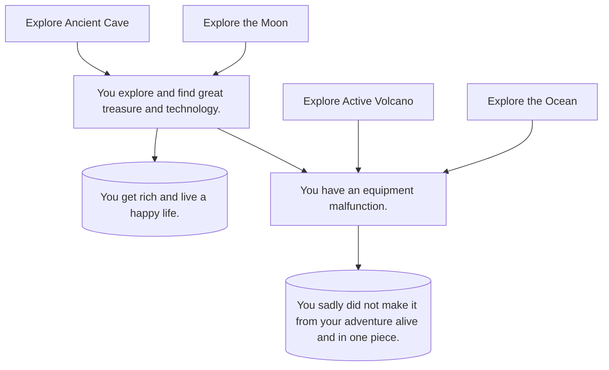

Choose Your Adventure:

This diagram represents someone who is choosing their own story. Each story the choose to follow with have its own pros and cons. The relationship between all of these adventures are that they all are pretty dangerous, and have different outcomes. In the end you might find yourself on a good situation or the adventure can be a waste and turn out bad!
